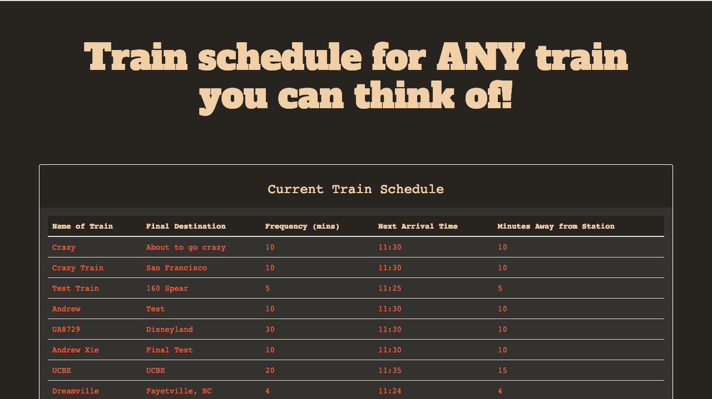
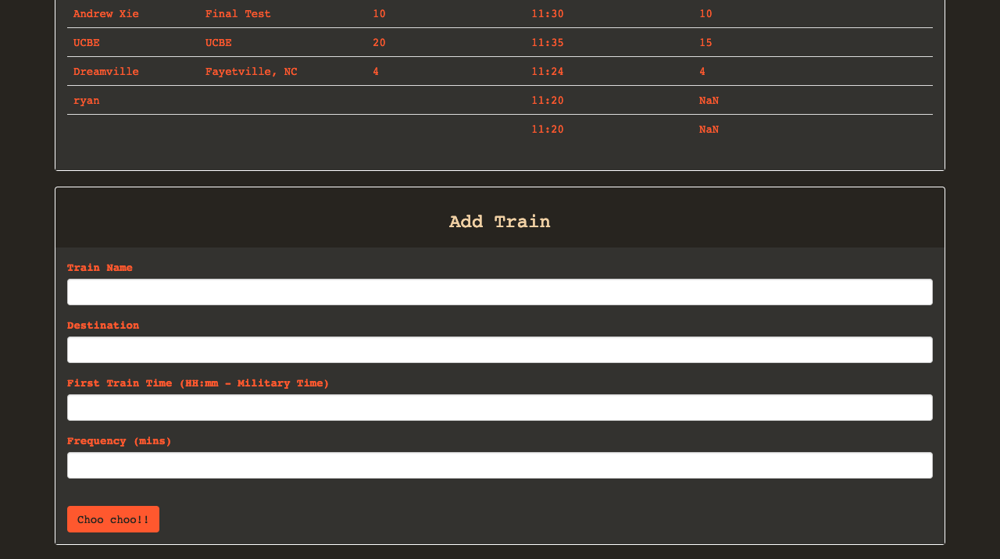

# 07 Homework: Train Schedule Assignment 

* Link to assignment: https://xieandrew2235.github.io/train_scheduler_basic/

For this assignment we had to create a train schedule application that incorporated Firebase to host arrival and departure data inputted by the user. The app retrieves and manipulates the information with Moment.js, which is a library in Javascript that manipulates date and time, which is then stored on Firebase and displayed on the screen, appending beneath the previous entry.

When the user opens the app, it is greeted by Thomas the Train, and the current train schedule that I had tested the app with. Upon scrolling down, there is a form for the user, which will ask if user would like to track a train, and if so, the user would input

* Train name
* Destination
* Time of first train (in military 24H time)
* Frequency of train

This information is pushed to firebase using "database.ref().push", which is declared by a variable created (var database).

For styling I added a background image to the jumbotron and different colors to the page. I also added a font from Google Fonts. I originally intended to add three different fonts to each section of the page, but ultimately decided that one single font would be a cleaner look. This page was built with bootstrap jumbotron, panel, form, and submit button.

## What I wanted to do that I didn't do

* Add a playing GIF to the jumbotron instead of a background image that I couldn't quite resize to my liking
* Firebase also gave me some issues with permission in random spots during this assignment (sometimes it would just suddenly console log PERMISSION_DENIED), in which case the app wouldn't function
